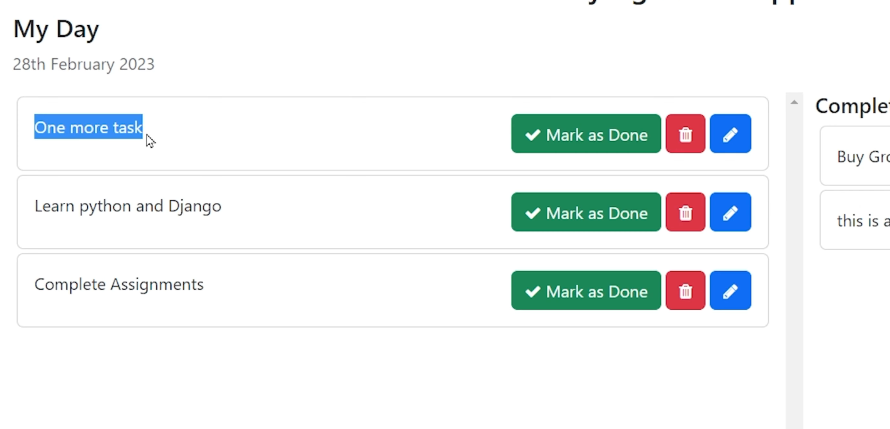

# Very First Step: 

1. Creating the Virtual Environment 
   >python -m venv env 

2. Activating Virtual Environment 
   >. env/Scripts/activate

Output: Now and env folder is created insider our To-Do-App

3. Now Installing Django
   > pip install Django

4. Verifying Installation of Django 
   > pip freeze

5. Creating a Django Project 
   > django-admin startproject todo_main .

now todo_main project is created inside To-Do-App

6. Running the Django App
    > python manage.py runserver 9000

# Day 2: Creating Superuser and Home 

If I run my admin panel and http://127.0.0.1:9000/admin  this will not run and says a error called OperationalError:no such table:django_session 

7. so to solve this let's first migrate the unapplied migration.
    >python manage.py migrate

After this the Admin Panel will work and shows the login dashboard 

8. Creating the Super User 
   >python manage.py createsuperuser

now our admin site is open 

9. Creating a path for home page 
   > Going to urls.py in todo-main 
   > Adding this path in urls.py ` path('', views.home, name="Home")`    
   > Creating a views.py file and adding this code for home page 

from django.http import HttpResponse    
def home(request):
    return HttpResponse('<h3> This is Homepage </h3>')

# Creating a Todo Template using Bootstrap

we earlier were showing a home page through HttpResponse but now we have to show home.html and for this we have to render it 

The code: 
  >from django.shorcuts import render 
  >def home(request):
  > return render(request,'home.html') 

1. Now making the template folder in project level directory
2. In setting also have to add 'templates' in DIR 

# Pushing the code to github 
1. Initializing git : ` git init `
2. then making .gitignore file to ignore unnecessary files like .env
3. git add . will add all the untracked files 
4. then git remote add orgin (repo_url) like:https://github.com/preeyankakc037/mytodo-django
5. verfiy by : git remote -v
6. for main branch git push origin main 
7. git commit -m "Initial Commit: Django-todo-app"
8. git push -u origin main

# Now making the add task options workable 
means it should have to be saved in database 

> We need a database field to store this task    
>that's why we need to create a model for storing this data 

# Creating a app for todo app 

> python manage.py startapp todo

registering the app in setting.py 
creating models in models.py 
now registering this model in admin.py of todo app 
as we created this model this means we also have to make migrations and migrate them 

> python manage.py makemigrations     
>python manage.py migrate

# Day 3 Fetching Tasks 

How to print the task that are not completed and completed in the frontend?

> We have to put the logic and it goes inside home function because we are going to print the task on the homepage.

> The home function is in the views.py of todo_main   
> After adding code in home function now we have to loop through a div in home.html

# Admin list Display 
In the admin site, if the task are too much how can we know which task is completed or not  
so we have to seperate the completed and incompleted task              

This is the current State 

For solving this go to admin.py of todo and add logic 

Now it becomes 

after adding search in the admin code logic

# How to add data to the database using add+ button 
now we'll  first go to urls.py of todo_main and and add code logic 
creating the urls.py in todo app 

# in video 3:22: minutes => Tech with Rathan 

# Add task with CSRF TOKEN

CSRF : Cross Site Request Forgery  ::::> meant to prevent unintentional data modification 
to prevent Cross Site Request Forgery attack
3:29 part finish 

# After this go to views.py of todo

# Day 4: Completed Task 
you'll need to write the logic in views.py of todo main 

then go in home.html and write the respective code in the realted section 

# Day 5: Mark the task as done - Making the button functional 

To make a particular task marked as done we need it's unique info 

for making one more task mark as done we need it's unique info or id 
for this we'll need primary key of this data 

Look at the Pk of the data or primary key of the data 

> Now we'll add the pk code in url.py of todo
> Then add the logic in views.py

# Task Undone

add the function in views.py, link in url and button in home.html and url 

# Edit Task Url Pattern 